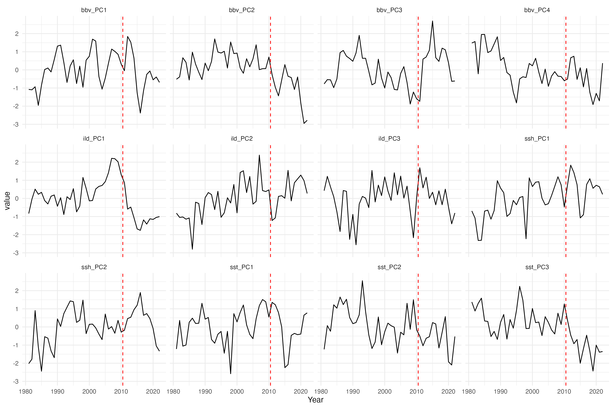
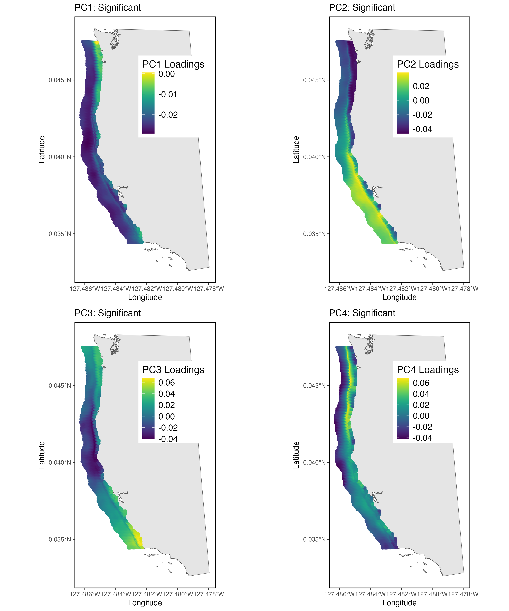
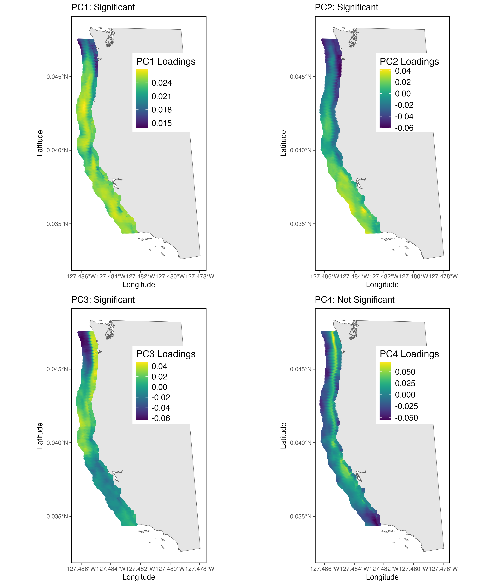
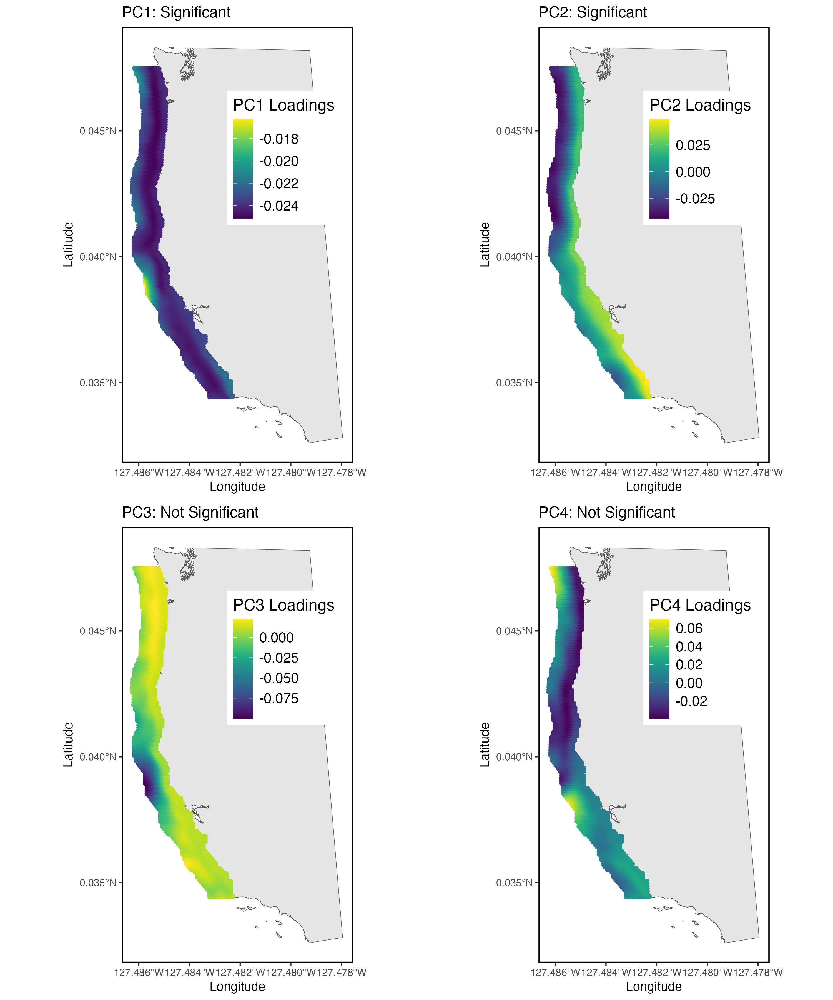
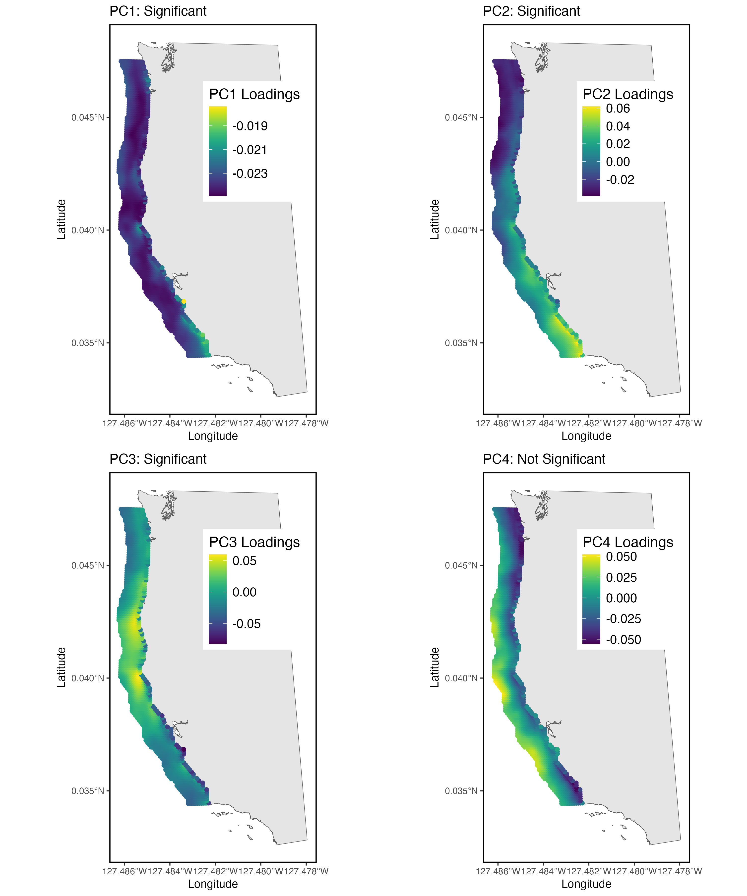
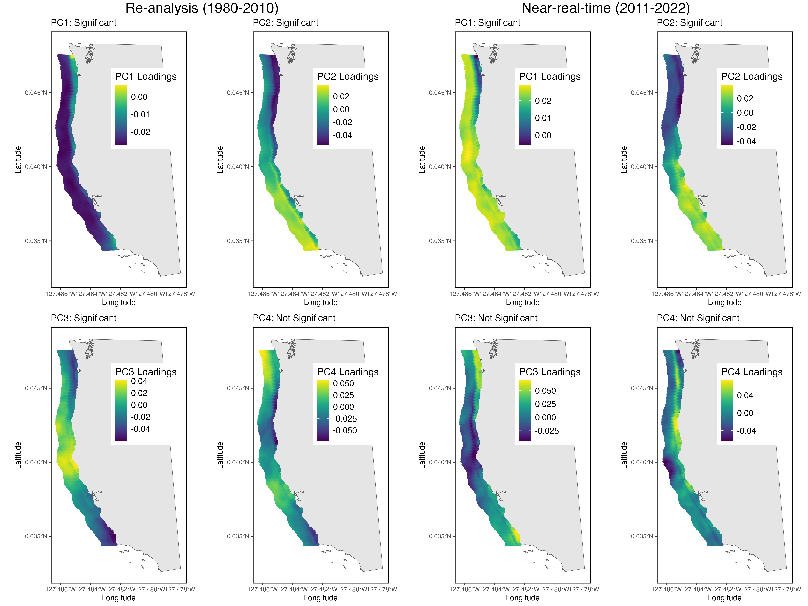
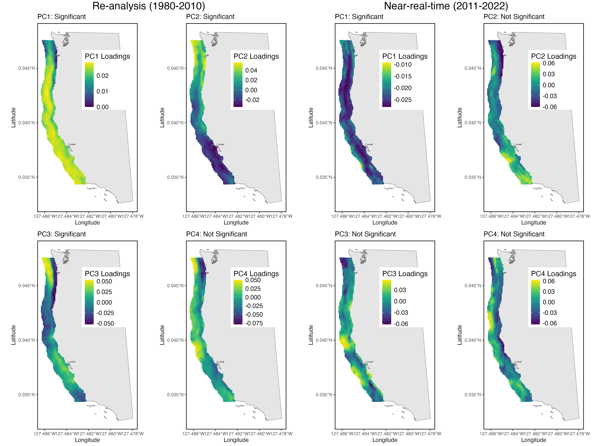
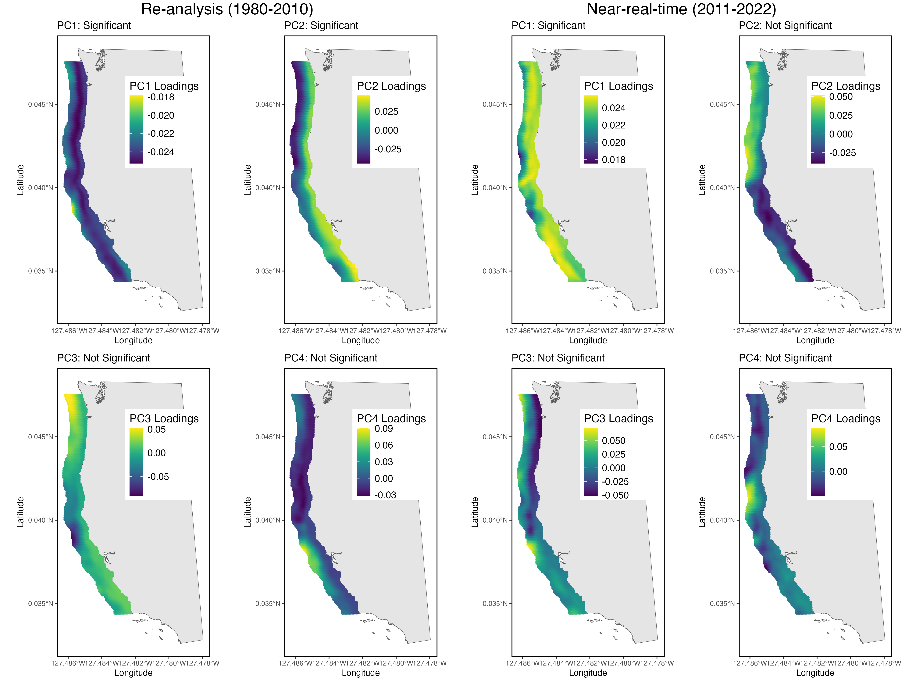
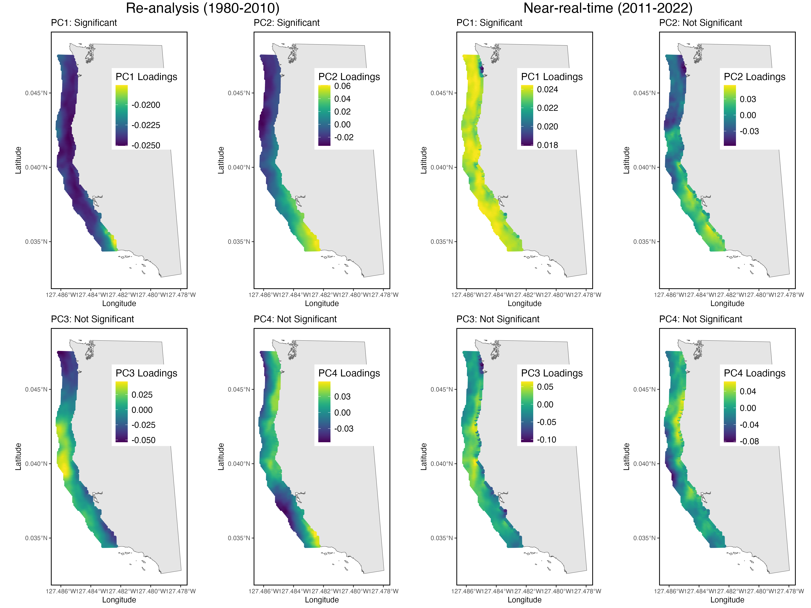

```{r, echo = FALSE, message = FALSE, warning = FALSE}
knitr::opts_chunk$set(echo = FALSE, message = FALSE, warning = FALSE)
```


## Predictor variables

The predictor variables used in this analysis are outputs from the (UCSC ROMS model)[https://www.cencoos.org/observations/models-forecasts/]. The UCSC ROMS model extends from 1980-2022, and is the model that has been used for numerous recruitment studies on the west coast, including @Ward2024, which explored different approaches for forecasting groundfish recruitment. However, this model is not being consistently updated, and consists of multiple oceanographic models stitched together (specifically, a 1980-2010 re-analysis, and a 2011-2022 near-real-time model). We will revisit the consequences of these two models being stitched together later.

<br>

## Initial suite of predictor variables

A description of the variables extracted from ROMS and their potential pathways to affect recruitment follows.

<br>

#### ROMS: Sea surface temperature (SST)

Temperature can affect recruitment through numerous pathways. Temperature can affect growth, which is a key process that affects recruitment by allowing larvae to escape predation pressure and feed more efficiently. It can also affect maternal energy budgets, spawning timing, and metabolic demands (and therefore starvation).

#### ROMS: Sea surface height (SSH)

Sea surface height (SSH) is an indicator of alongshore and cross-shelf transport in the California Current [@Tolimieri2023]. Transport is hypothesized to be highly relevant to recruitment, as it relates to both retention of larvae in productive areas and food availability (e.g., southerly transport can bring nutrient-dense Northern copepods into the California Current).

#### ROMS: Isothermal layer depth (ILD)

Isothermal layer depth (ILD), defined as the depth at which temeprature deviates from 0.5 C from the surface, is a measure of the ocean surface layer depth, which is generally considered to be a quasi-homogenous layer (in terms of density and temperature) at the surface of the ocean [@Kara2000]. Classical fisheries recruitment literature hypothesizes that the stability of the surface layer (the habitat of pelagic groundfish larvae) is highly relevant to recruitment processes. For example, the “Stable Ocean Hypothesis” stated that it was not only the abundance of food, but also the degree of aggregation of food (which a stable, i.e., not turbulent, ocean was necessary for) that provided for good feeding conditions [@Lasker1981]. A related hypothesis, the Optimal Environmental Window hypothesis [@Cury1989], states that in Ekman-type (wind-driven) upwelling systems, there exists an optimal window for larval fish survival (and therefore recruitment). This optimal window is the result of the dome-shaped relationship between upwelling (which is related to turbulence) and recruitment. This is because at higher wind speeds, despite higher primary productivity, mixing begins to occur and disrupts the food aggregations necessary for larval fish to feed on, leading to a tradeoff between food availability and turbulence.

#### ROMS: Brunt Väisälä frequency (BV)

Brunt Väisälä frequency (BV) is a measure of water column stratification, averaged over the upper 200 m of the water column. Similar to ILD, BV also serves as an index of water column structure, and therefore shares the same hypothesized links to recruitment as listed under ILD.

#### Coastal Upwelling Transport Index (CUTI)

CUTI provides estimates of vertical transport near the coast (i.e., upwelling/downwelling). It was developed as a more accurate alternative to the previously available ‘Bakun Index’. This index is available in one-degree latitudinal bands along the U.S. West Coast.

#### Biologically Effective Upwelling Transport Index (BEUTI)

BEUTI provides estimates of vertical nitrate flux near the coast (i.e., the amount of nitrate upwelled/downwelled), which may be more relevant than upwelling strength when considering some biological responses. This index is available in one-degree latitudinal bands along the U.S. West Coast.

<br>
<br>

## EOF on ROMS outputs

While the two upwelling indices, CUTI and BEUTI, are averaged across the three biogeographic provinces of the California Current (North/Central/South), the other variables (SSH, SST, BV, and ILD) are composed of monthly spatial fields at a 10 km grid cell resolution. For this preliminary analysis, a PCA was run on these fields, subset to within 100 km of the coast, and significant predictors according to Horn's parallel analysis test extracted.

The time series of these significant principal components are visualized below, with the red dashed line showing the transition from the re-analysis to the near-real-time oceanographic model:



<br>

### Loadings of the spatial fields on the principal components {.tabset .tabset-pills}

Here, the first four principal components are shown for each oceanographic variable, and noted whether or not these principal components are significant.

#### Brunt Väisälä frequency (BV)



#### Isothermal layer depth (ILD)



#### Sea surface height



#### Sea surface temperature



<br>
<br>

<br>
<br>


### ROMS: Re-analysis (1980-2010) + near-real-time (2011-2022) model comparisons {.tabset .tabset-pills}

Here, I show the patterns captured by each of the first four principal components when the EOF is run on the re-analysis vs. the near-real-time product.

#### Brunt Väisälä frequency (BV)



#### Isothermal layer depth (ILD)



#### Sea surface height



#### Sea surface temperature



<br>
<br>
<br>

## References

