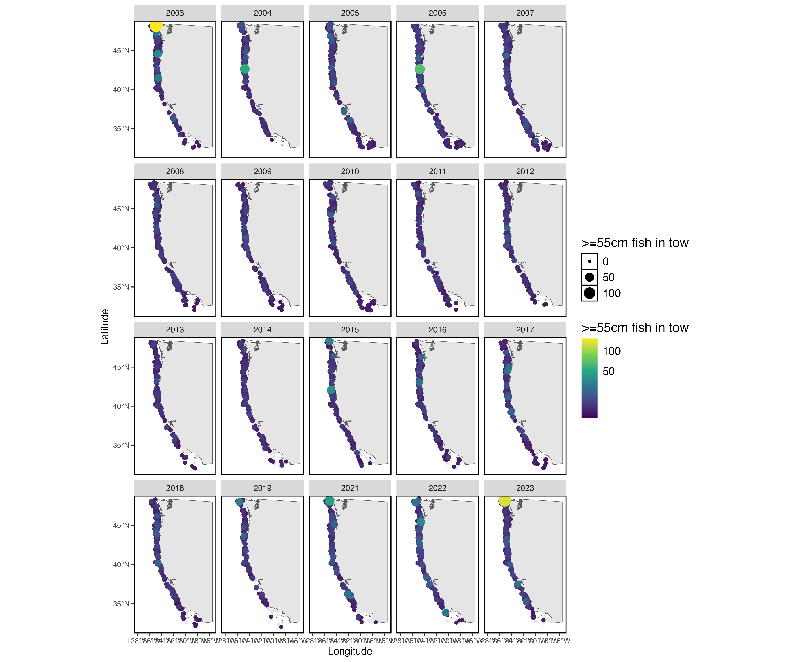

The juvenile stages of some stocks are well surveyed by the West Coast Groundfish Bottom Trawl Survey. Here, I show a number of different age and length classes for Sablefish caught in the survey, as well as the correlation between the age-0 and age-1 fish caught in the survey and the recruitment estimates from the stock assessment. For the age and length compositions, I show the estimated fish of each age and length class in the survey, based on the extrapolation of the age and length sub-samples of each tow to the full number of fish caught in that tow. Note that this has typically been 20 lengths per tow and 4 ages per tow, and therefore the extrapolation is based on a much larger sample size for lengths.

Below, I show age-0 and age-1 fish to show the distribution of recent recruits, and age-7+ fish for the distribution of potential spawners (age at 50% maturity was estimated to be 6.86 years in Head et al. 2014). I also show the length-based estimates for age-0 recruits (<=29 cm) and for spawners (>= 55cm, again based on the L50 estimated in Head et al. 2014).

Note that these age-0 and age-1 fish are included in the stock assessment, which means that they do inform the estimate of recruitment. The age-0 and age-1 fish could be used as either our estimates of recruitment, or be included as a predictor for recruitment (but note that this becomes problematic because they are already informing the estimate of recruitment).

 

{width=100%}
 

{width=100%}

 

{width=100%}

 

{width=100%}

 

{width=100%}

 

{width=100%}
