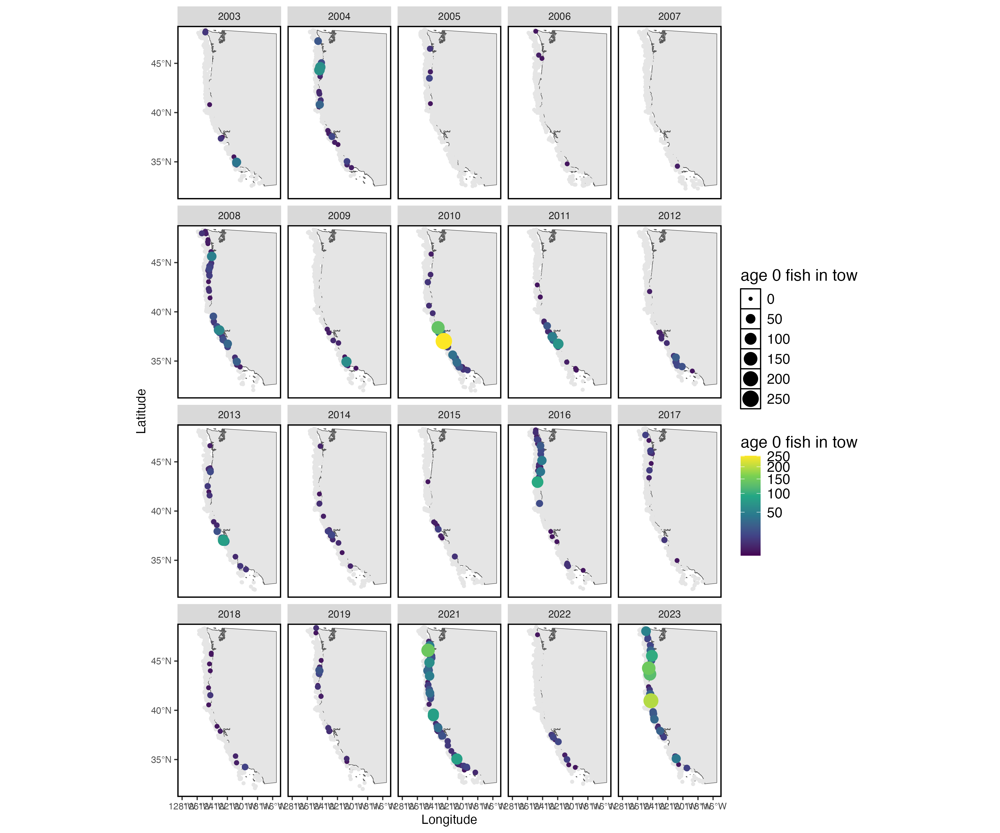
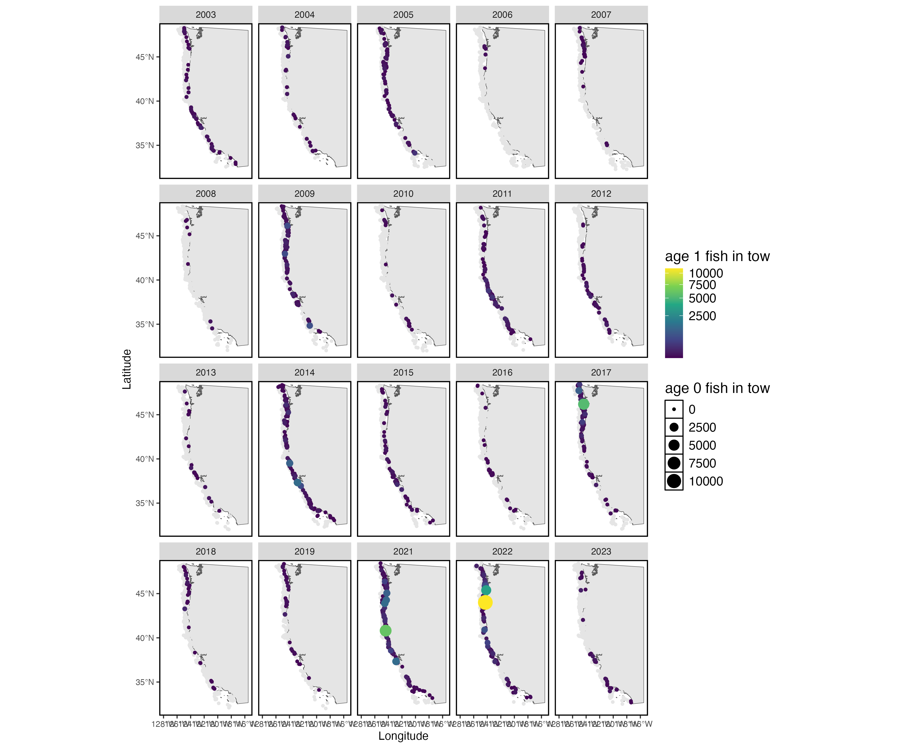
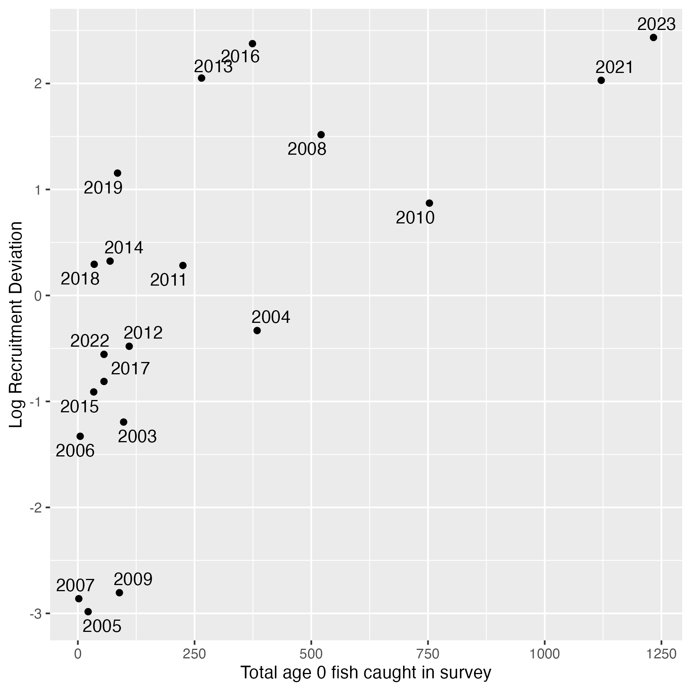
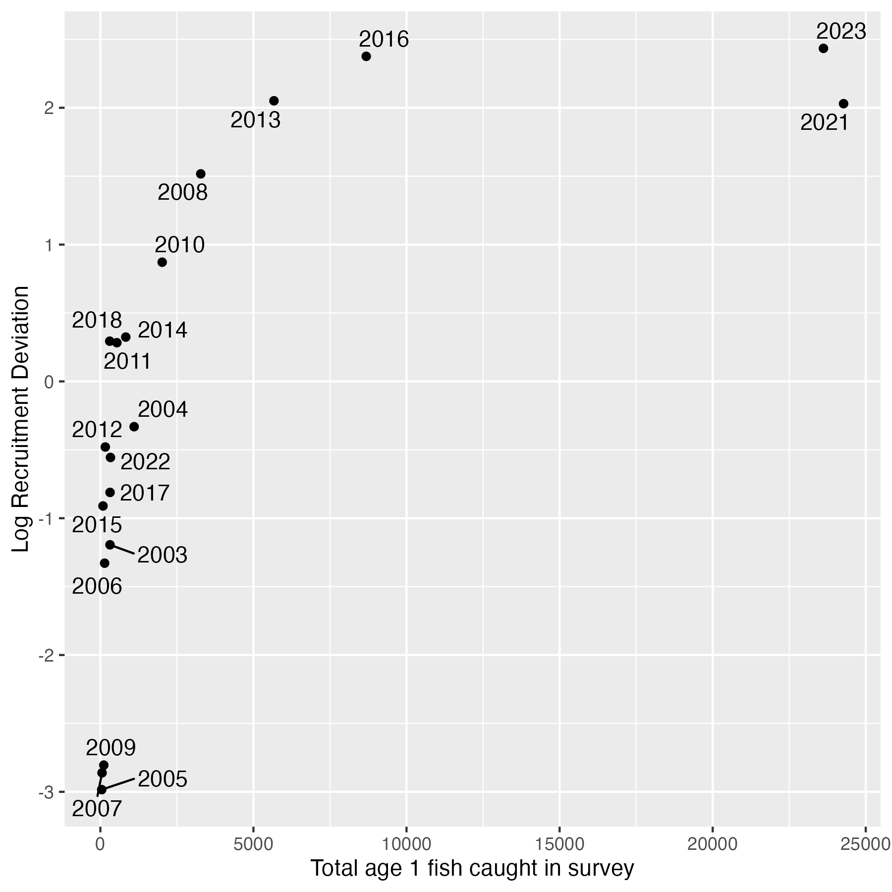

The juvenile stages of some stocks are well surveyed by the West Coast Groundfish Bottom Trawl Survey. Here, I show age-0 and age-1 Sablefish caught in the survey, and their correlation with the recruitment estimates from the stock assessment.

Note that these age-0 and age-1 fish are included in the stock assessment, which means that they do inform the estimate of recruitment. The age-0 and age-1 fish could be used as either our estimates of recruitment, or be included as a predictor for recruitment (but note that this becomes problematic because they are already informing the estimate of recruitment).

 

{width=100%}
 

{width=100%}

 

{width=100%}

 

{width=100%}
